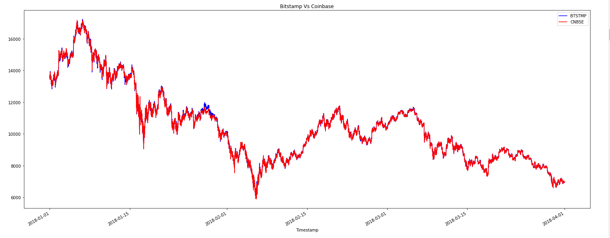
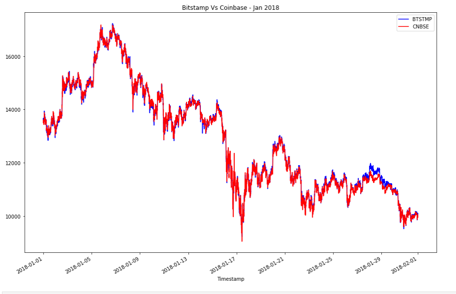
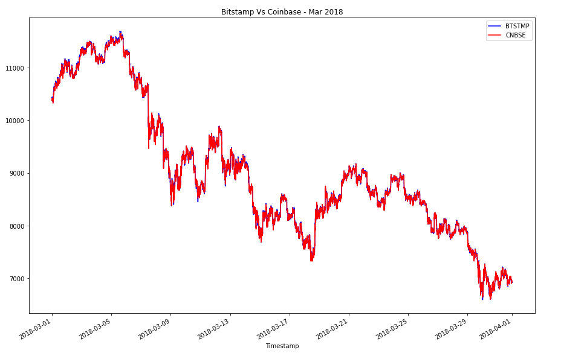
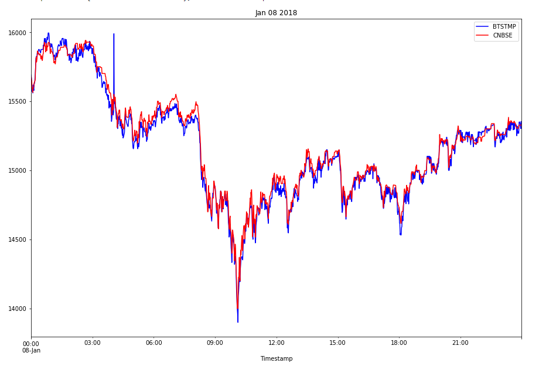
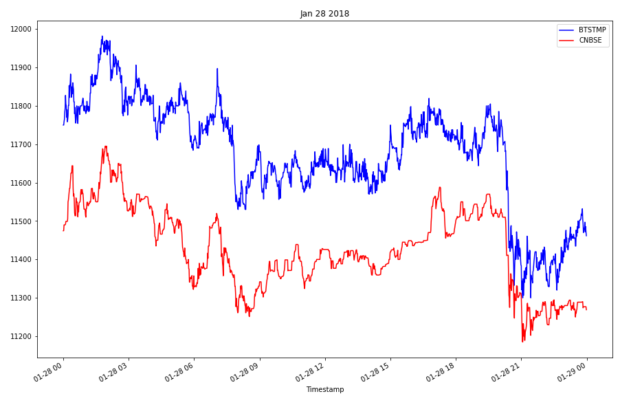
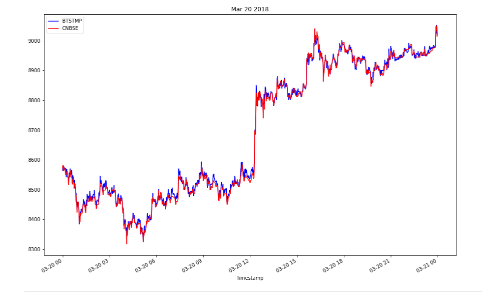
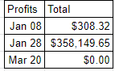
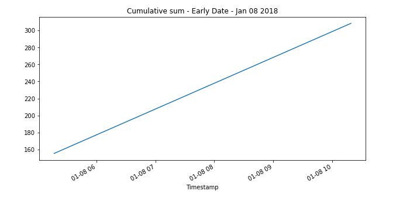
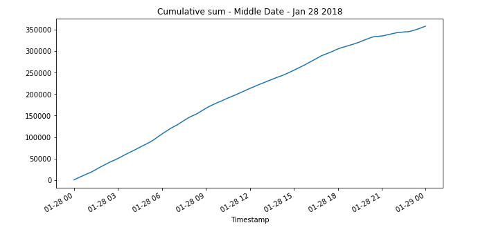
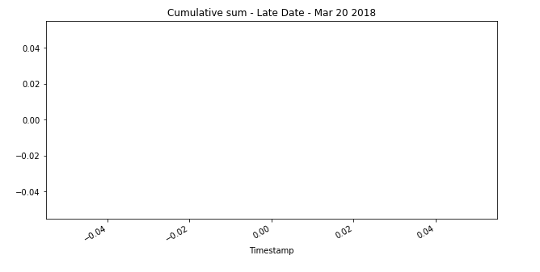

# Bitcoin_Arbitrage

# Analyzing Bitcoin/Cryptocurrency Arbitrage opportunities.

Bitcoin/Cryptocurrency arbitrage opportunity occurs when Bitcoin/Cryptocurrency is available at a cheaper price at 
one exchange compared to another exchange. So, we can take advantage of this opportunity by purchasing the cryptocurrency
at the lower priced exchange and selling it as the higher priced exchange. The two exchanges that we analyze are bitstamp
and coinbase. During a given day, at different times, Bitcoin can be purchased at a cheaper price on bitstamp and sold at coinbase
or purchased at a cheaper price on coinbase and sold at bitstamp. We analyse all such opportunities and figure out the potential
profit in doing so. 

### Overall Analysis
When looking at the overlay of the data from the two exchanges for the entire period, we can see arbitrage opportunities, when there is a clear demarkation between the plots of the two exchanges. It can be seen that in the early period we can see periods of clear distinction between the two exchanges. But as time progresses, both the plots follow each other very closely, almost overlapping each other without any space. This leads us to believe that maybe this investment field is already saturated and maybe not a good field to gain a good amount of profit. 



### Earlier vs Later Period
Analyzing the earlier period vs later period, we find that there appear to be more arbitrage opportunities in the 
earlier period as compared to the later period. This is true in any arbitrage situation. Once people figure out the 
potential to profit from the price difference, the gap closes very quickly. 




### Analyzing specific dates
Analyzing specific dates in the early, middle and later periods show that there are more opportunities in the early part
of the day and the profit reduces as the day progresses. It also reinforces the earlier conclusion, that the profit margin was greater in earlier periods of the dataset and it diminishes, eventually becoming zero in the later parts of the data set. 





### Profit
Analyzing the profit opportunities confirms that profits can be made in the earlier period but there is no profit to be made in the later period. During the earlier period, profit can be made in the early part of the day and it reduces as the day progresses

* Profit Summary Table



* Jan 08, 2018 - Cumulative arbitrage profits 



* Jan 28, 2018 - Cumulative arbitrage profits 

 

* Mar 20, 2018 - Cumulative arbitrage profits




### Assumptions and Discovery
We are assuming that anytime a price is low on an exchange and high on another exchange, we can buy at the low exchange and sell at the higher exchange without any issues. On Jan 08th, 2018, we discover that for most of the day bitstamp prices are lower than the coinbase price. So we buy from bitstamp and sell at coinbase to maximize our profit for that day. On Jan 28th, 2018, we only see profitable trades when we buy at coinbase and sell at bitstamp. On March 20, 2018, we don't see any profits. This confirms the overall trend that arbitrage profits dry up as more and more people discover the price discrepancy. During any given day we also discover there are possibilities of arbitrage early in the day and they dry up as people discover the price discrepancy with the passage of time. It appears that the over all potential for arbitrage has dried up as people have discovered the opportunity and we don't forsee future profitability in this trade.

---

## Technologies

This project uses python 3.7 along with the following packages:

* [JupyterLab](https://jupyterlab.readthedocs.io/en/stable/) - Web based user interface for data analysis.

* [pandas](https://github.com/pandas-dev/pandas) - Data analysis and manipulation library.

* [matplotlib](https://github.com/matplotlib/matplotlib) - Library for creating visualization in Python.

---

## Installation Guide

The application uses the pandas and Jupyterlab packages. Before running the application, first install these packages using the `pip` command at the command line.

```python
  pip install jupyterlab
  pip install pandas
```


---

## Usage

To use the crypto arbitrage analysis, please download and open the **crypto_arbitrage.ipynb** in jupyter lab after executing
the following on the command line:

```python
jupyter lab
```
Jupytper Lab should open automatically in a browser. 
If it does not, please follow the instructions on the command line.

---

## Contributors

Created by Abhishika Fatehpuria
email: abhishika@gmail.com

---

## License

MIT
